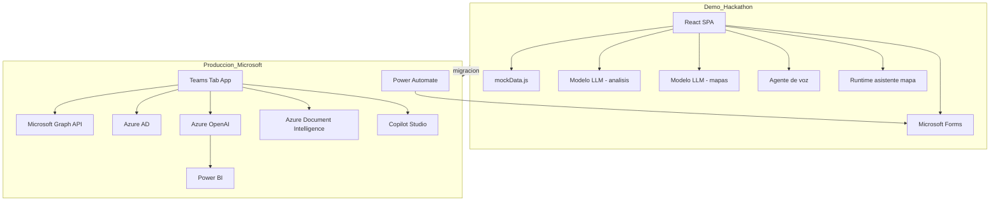
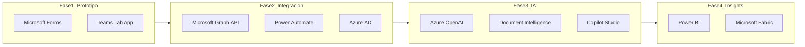

# DEFENSA_QA.md — TutorIA
> Guía interna del equipo para la ronda de preguntas y respuestas del Hackathon Universitario de Impacto Social con AI — Microsoft México.
> **Uso:** leer antes de la exposición grabada y tener a mano durante el Q&A con jurado.

---

## 0. Narrativa central (memorizar)

TutorIA **está diseñada para funcionar dentro del ecosistema Microsoft** (Teams, Forms, Azure, Copilot). En el hackathon no pudimos completar todas las integraciones Microsoft como las teníamos planeadas por **limitaciones externas** — tiempo del evento, acceso a APIs de Azure, configuración de tenant institucional, etc.

Lo que presentamos es un **prototipo funcional navegable** que demuestra el flujo de producto completo: detección temprana → intervención del profesor → diagnóstico del alumno → apoyo personalizado. La arquitectura apunta a Microsoft en producción; donde la demo usa alternativas, fue para no bloquear la experiencia de usuario.

**Reto atacado:** Reto 1 — Educación y Brecha Digital.

---

## 1. Resumen ejecutivo (30 segundos)

**Problema:** En el IPN (y en la educación superior en general), un profesor con 30–50 alumnos solo descubre quién está en riesgo al final del parcial — cuando ya es tarde para intervenir.

**Solución:** TutorIA detecta señales de riesgo académico **durante el parcial** (semanas 2–3) y activa un acompañamiento personalizado: el profesor recibe un análisis claro, envía un cuestionario diagnóstico, y el alumno recibe apoyo adaptado a su situación (académica, económica o emocional).

**Diferenciador:**
- Intervención **temprana**, no reactiva.
- Dos flujos: iniciativa del **profesor** (materia roja) e iniciativa del **alumno/plataforma** (materia morada).
- Integración pensada para **Microsoft Teams** — donde ya vive la clase.
- Agente conversacional con voz que explica el *por qué*, no solo un semáforo.

**Para quién:** Profesores y alumnos del IPN.

---

## 2. Stack tecnológico

### 2.1 Capa A — Ecosistema Microsoft (enfatizar en la exposición grabada)

| Componente | Rol en TutorIA | Estado en la demo |
|------------|----------------|-------------------|
| **Microsoft Teams** | Canal de clase, material del profesor (PDFs), notificaciones al alumno | UI y metadata representativa; integración Graph API planificada |
| **Microsoft Forms** | Cuestionario diagnóstico (académico, económico, emocional) | **Real** — formulario hospedado en `forms.office.com` |
| **Experiencia Copilot** | Asistente contextual en el mapa de estudio (resaltar nodos, agregar conceptos) | Funcional vía runtime de agente conversacional |
| **Azure (roadmap)** | OpenAI, Document Intelligence, hosting, autenticación | Planificado para producción |

### 2.2 Capa B — Prototipo de hackathon (mencionar solo si preguntan)

| Componente | Uso actual en la demo | Equivalente Microsoft en producción |
|------------|----------------------|-------------------------------------|
| React 19 + Vite 8 | Frontend SPA | Teams Tab App + Azure Static Web Apps |
| Modelo de lenguaje (Claude) | Análisis de alumno, chat alumno, guías de estudio | **Azure OpenAI** |
| Modelo de lenguaje (Gemini) | Generación de mapas conceptuales JSON + chat del mapa | **Azure OpenAI** con structured output |
| Agente de voz (ElevenLabs) | TutorIA habla con profesor y alumno | **Azure Speech Services + Copilot Studio** |
| Express 5 (local) | Runtime del asistente del mapa | **Azure Functions / App Service** |
| React Router 7 | Navegación | Sin cambio (dentro de Teams Tab) |
| Tailwind CSS 4 | Estilos | Sin cambio |
| Recharts | Dashboard analítico del alumno | Power BI en fase de insights |
| React Flow + Dagre | Mapa conceptual interactivo | Sin cambio (UI) |

> **Regla de oro en la grabación:** hablar de "modelo de lenguaje", "agente conversacional con voz" y "experiencia tipo Copilot". No nombrar proveedores no-Microsoft en el pitch principal.

### 2.3 Arquitectura actual vs. arquitectura objetivo



### 2.4 Dependencias clave (referencia interna)

Archivo: `package.json`

| Paquete | Propósito |
|---------|-----------|
| `@elevenlabs/react` | Agente de voz TutorIA |
| `@copilotkit/react-core`, `@copilotkit/react-ui`, `@copilotkit/runtime` | Asistente del mapa conceptual |
| `@xyflow/react`, `@dagrejs/dagre` | Mapa conceptual interactivo |
| `recharts` | Gráficas del dashboard |
| `framer-motion`, `three` | Animaciones y esfera 3D en landing |
| `express`, `cors`, `dotenv` | Servidor local del runtime CopilotKit |
| `react-router-dom` | Routing |
| `sileo` | Notificaciones toast (cuestionario) |

### 2.5 Variables de entorno (`.env.example`)

| Variable | Uso |
|----------|-----|
| `VITE_ANTHROPIC_API_KEY` | Análisis, chat, guías (frontend) |
| `VITE_GEMINI_API_KEY`, `VITE_GEMINI_MODEL` | Mapas conceptuales (frontend) |
| `GEMINI_API_KEY` / `GOOGLE_API_KEY` | Runtime CopilotKit (backend local) |
| `VITE_ELEVENLABS_AGENT_ID` | Agente de voz TutorIA |

Si falta alguna key, la app degrada a **texto estático de demostración** — la demo sigue navegable.

---

## 3. Flujos de la demo — qué mostrar en vivo

### 3.1 Secuencia recomendada (profesor → alumno)

```
1. Landing (/) → "Soy Profesor"
2. /login/profesor → cualquier credencial funciona
3. /profesor/materias → ver materias con badge de riesgo
4. /profesor/materia/calc1 → tabla de alumnos (rojo arriba)
5. Clic en Juan Pérez García (boleta 2021630042, riesgo alto)
   → /profesor/alumno/2021630042
   → Pantalla dividida: TutorIA (voz) + Dashboard analítico
6. Al terminar el análisis → toast "Enviar cuestionario"
7. Cambiar a flujo alumno:
   /login/alumno → /alumno/materias
8. Materia ROJA (Cálculo) → /alumno/materia/rojo/calc1
   → Apoyo del profesor + selector de guía + mapa conceptual
9. /alumno/materia/rojo/calc1/mapa → mapa interactivo + asistente Copilot
10. Materia MORADA (Física) → /alumno/materia/morado/fis1
    → Chat interactivo con agente + guía auto-generada
```

### 3.2 Datos demo clave

| Actor | Credencial documentada | Comportamiento real |
|-------|------------------------|---------------------|
| Profesor | `profesor@ipn.mx` / `demo1234` | Siempre loguea a Dr. Carlos Ramírez |
| Alumno | boleta `2021630001` / `demo1234` | Siempre loguea a María González López |

> El login **no valida** credenciales — cualquier input funciona. Decir en Q&A: "En producción sería Azure AD institucional."

### 3.3 Alumno estrella para demo profesor

**Juan Pérez García** — boleta `2021630042`, Cálculo Diferencial:
- Asistencia: 60%
- Tareas: 4/8
- Calificación actual: 4.8 (reprobado)
- Parcial anterior: 7.2
- Declive: -2.4 puntos
- Nivel de riesgo: alto

Estos datos activan todas las reglas de intervención del agente (ver sección 5.1).

### 3.4 Rutas completas de la app

| Ruta | Descripción | Auth |
|------|-------------|------|
| `/` | Landing | No |
| `/login/profesor`, `/login/alumno` | Login demo | No |
| `/profesor/materias` | Dashboard materias | Sí |
| `/profesor/materia/:id` | Tabla alumnos | Sí |
| `/profesor/alumno/:boleta` | Análisis + TutorIA voz | Sí |
| `/alumno/materias` | Materias con semáforo | Sí |
| `/alumno/materia/rojo/:id` | Apoyo del profesor | Sí |
| `/alumno/materia/rojo/:id/mapa` | Mapa conceptual | Sí |
| `/alumno/materia/morado/:id` | Chat + guía | Sí |

**No existen rutas** para materias verdes ni para `Seguimiento`/`Reporte` como páginas independientes.

---

## 4. Matriz REAL vs. SIMULADO

Esta tabla es **crítica** para el Q&A. Todo el equipo debe conocerla.

| Funcionalidad | ¿Real? | ¿Simulado? | Evidencia |
|---------------|--------|------------|-----------|
| Datos académicos (notas, asistencia, riesgo) | | ✓ | `src/services/mockData.js` — todo hardcodeado |
| Login y sesión | | ✓ | `LoginProfesor.jsx` / `LoginAlumno.jsx` — siempre usa usuario demo #0 |
| CAPTCHA alumno | | ✓ | No implementado (Context.md lo promete) |
| Validación de rol (profesor vs alumno) | | ✓ | `RequireAuth.jsx` solo verifica sesión, no rol |
| Cálculo automático de riesgo | | ✓ | `nivel_riesgo` viene pre-asignado en mockData |
| Análisis IA del alumno (profesor) | ✓ | fallback | `anthropicService.js` → `analizarAlumno()` |
| Agente de voz TutorIA | ✓ | fallback typewriter | `TutorIA.jsx` + ElevenLabs |
| Chat interactivo (materia morada) | ✓ | fallback | `ChatAgente.jsx` + `chatAgente()` |
| Generación de guías de estudio | ✓ | fallback | `generarGuia()` |
| Mapa conceptual | ✓ | fallback demo | `mapaGeminiService.js` + React Flow |
| Asistente del mapa (tipo Copilot) | ✓ | requiere server | `copilotRuntime.js` + `MapaCopilotBridge.jsx` |
| Microsoft Forms (cuestionario) | ✓ | | URL real en `cuestionarioToast.js` |
| Envío de cuestionario al alumno | | ✓ | Toast con timeout; no envía notificación real |
| Ingesta de respuestas de Forms | | ✓ | No hay webhook ni Power Automate |
| Reporte post-cuestionario (IA) | ✓ código | ✓ cableado | `Reporte.jsx` existe pero **no está conectado** al flujo |
| Flujo Seguimiento profesor | | ✓ | `Seguimiento.jsx` huérfano — reemplazado por toasts |
| Carga CSV/PDF del profesor | | ✓ | Spinner 2s en `MateriasProfesor.jsx`, ignora archivo |
| Integración Teams (Graph API) | | ✓ | Solo strings de metadata en mockData |
| Material del profesor en Teams | | ✓ | PDFs referenciados pero no cargados |
| Notificación "recibirá por Teams" | | ✓ | Texto del toast, no hay envío real |
| Mascota global (Context.md) | | ✓ | `Mascota.jsx` no montada en `App.jsx`; reemplazada por `TutorIA` |
| Persistencia de datos | | ✓ | Sesión en memoria; se pierde al refrescar |
| API keys en producción segura | | ✓ | Llamadas LLM desde browser (solo hackathon) |

---

## 5. Puntos débiles de la idea — y cómo defenderlos

### 5.1 "¿Cómo detectan el riesgo si no hay algoritmo?"

**Debilidad:** Los niveles de riesgo están pre-asignados en datos de demostración; no hay motor de scoring en tiempo real.

**Respuesta sugerida:**
> "En la demo usamos datos representativos del IPN. La lógica de detección está definida en reglas de negocio alineadas al sistema de calificaciones del IPN: asistencia menor al 70%, calificación menor a 6, o declive de 2+ puntos combinado con calificación baja. En producción, esas reglas correrían automáticamente sobre datos reales del LMS o Teams, con posibilidad de enriquecer con modelos en Azure Machine Learning."

**Reglas concretas** (documentadas en `TUTORIA_AGENT_PROMPT.md`):
- Asistencia < 70% → crítico
- Calificación < 6 → reprobado, intervención necesaria
- Declive ≥ 2 puntos + calificación < 7 → intervención
- Declive ≥ 3 puntos → urgente

### 5.2 "¿Por qué semanas 2–3 del parcial?"

**Debilidad:** No hay lógica temporal en el código; es una afirmación de producto.

**Respuesta:**
> "Es la ventana donde aún hay margen de recuperación antes de la evaluación parcial. La demo ilustra ese momento de intervención; en producción, el sistema se activaría con triggers temporales conectados al calendario académico del IPN."

### 5.3 "¿Teams está realmente integrado?"

**Debilidad:** No hay Microsoft Graph API, Copilot Studio ni Teams Tab App desplegada.

**Respuesta:**
> "TutorIA está diseñada como Teams Tab App: el profesor sube material al canal, el alumno recibe notificaciones ahí, y el cuestionario se envía vía Forms integrado. En el hackathon usamos datos representativos del material en Teams; la integración con Graph API es el siguiente paso natural con Teams Toolkit."

### 5.4 "¿Por qué no usaron Azure OpenAI?"

**Debilidad:** Se usa Claude (Anthropic) y Gemini (Google) en la demo.

**Respuesta:**
> "El acceso a servicios Azure no estuvo disponible a tiempo por limitaciones externas del evento. Toda la capa de IA está abstraída en servicios (`anthropicService.js`, `mapaGeminiService.js`) que se pueden migrar a Azure OpenAI sin cambiar la experiencia de usuario — solo cambia el endpoint y el modelo."

### 5.5 "¿Es Copilot Studio o otra cosa?"

**Debilidad:** CopilotKit ≠ Copilot Studio (producto Microsoft).

**Respuesta:**
> "La demo reproduce la experiencia de un asistente Copilot contextual — en el mapa de estudio puede resaltar conceptos, agregar nodos y simplificar el mapa según lo que el alumno pregunta. En producción, ese agente viviría en Copilot Studio conectado a Teams y al material del curso."

### 5.6 "¿Privacidad y protección de datos?"

**Debilidad:** No hay política de privacidad, encriptación ni cumplimiento documentado.

**Respuesta:**
> "En la demo no hay datos reales de alumnos — todo es ficticio. En producción, la autenticación sería Azure AD institucional, los datos se alojarían en Azure con cifrado en tránsito y reposo, y se respetarían las políticas de privacidad del IPN. El profesor siempre tiene control sobre qué intervenciones se activan."

### 5.7 "¿El profesor puede confiar en la IA?"

**Respuesta:**
> "La IA no reemplaza al profesor — le explica *por qué* un alumno está en riesgo con datos concretos (asistencia, tareas, tendencia). El profesor decide si enviar el cuestionario. Es un radar inteligente, no un dictamen automático."

### 5.8 "¿Qué pasa si el alumno no responde al cuestionario?"

**Respuesta:**
> "El flujo morado permite que el alumno tome la iniciativa sin esperar al profesor. Si ninguno actúa, el sistema no genera ruido — los alumnos en verde no reciben alertas innecesarias. El profesor puede escalar manualmente."

### 5.9 "¿Por qué las API keys están en el browser?"

**Debilidad:** `anthropicService.js` y `mapaGeminiService.js` llaman APIs directamente desde el frontend.

**Respuesta:**
> "Es una decisión de prototipo para acelerar la demo del hackathon. En producción, todas las llamadas pasarían por un backend en Azure Functions con autenticación, rate limiting y sin exponer keys al cliente."

### 5.10 "¿Microsoft Forms está conectado de verdad?"

**Debilidad:** El formulario abre en otra pestaña; no hay webhook que traiga respuestas de vuelta a la app.

**Respuesta:**
> "El cuestionario es un Microsoft Form real hospedado en forms.office.com. Lo que falta para cerrar el loop es Power Automate: cuando el alumno responde, un flujo automático procesa las respuestas y genera el reporte para el profesor. Eso es configuración, no arquitectura nueva."

### 5.11 "¿Por qué un agente de voz de terceros?"

**Debilidad:** ElevenLabs no es Microsoft.

**Respuesta:**
> "Queríamos demostrar que el acompañamiento puede ser conversacional y accesible — especialmente relevante para la brecha digital. En producción migraríamos a Azure Speech Services integrado con Copilot Studio, manteniendo la misma experiencia de TutorIA hablando con el alumno."

### 5.12 "¿Escala a 50 alumnos × N materias?"

**Respuesta:**
> "El análisis de riesgo se puede ejecutar en batch sobre todos los alumnos al cargar la lista. El dashboard del profesor ya muestra resumen por materia. En producción, Power BI daría vistas agregadas y tendencias históricas."

### 5.13 "¿Por qué no intervenir en alumnos verdes?"

**Respuesta:**
> "Evitar fatiga de alertas es clave. Solo se activa intervención cuando hay señales reales. Un alumno con 8.5 y 90% de asistencia no necesita un chatbot — eso está en las reglas del agente."

### 5.14 "¿En qué se diferencia del LMS (Moodle, SIIP)?"

**Respuesta:**
> "No reemplazamos el LMS — somos una capa de early warning y acompañamiento IA sobre los datos que ya existen. El LMS registra calificaciones; TutorIA interpreta tendencias, diagnostica causas raíz y propone acciones concretas dentro del ecosistema donde ya trabajan profesor y alumno: Teams."

---

## 6. Guía de lenguaje para la exposición grabada

### 6.1 Decir (visible, seguro)

- "Integrado con **Microsoft Forms** para el cuestionario diagnóstico."
- "Diseñado para vivir dentro de **Microsoft Teams** como Tab App."
- "Asistente con **experiencia Copilot** en el mapa de estudio."
- "Preparado para **Azure OpenAI** y **Azure Document Intelligence**."
- "Prototipo funcional con datos de demostración del IPN."
- "Detección temprana durante el parcial, no después."
- "El profesor mantiene el control — la IA asiste, no decide."

### 6.2 Evitar o minimizar

| Evitar | Usar en su lugar |
|--------|------------------|
| Anthropic, Claude | "modelo de lenguaje" / "Azure OpenAI en producción" |
| Google Gemini | "modelo de IA" / "Azure OpenAI con salida estructurada" |
| ElevenLabs | "agente conversacional con voz" / "Azure Speech" |
| CopilotKit (como marca) | "experiencia tipo Copilot" / "asistente contextual" |
| mock, fake, hardcoded | "datos de demostración", "prototipo funcional" |
| "No implementamos Teams" | "la integración Graph API es el siguiente paso" |
| "No pudimos usar Microsoft" | "priorizamos la experiencia de usuario; la migración a Azure está planificada" |

### 6.3 Si preguntan directamente por tecnologías no-Microsoft

> "Usamos APIs de terceros donde el acceso a servicios Azure no estaba disponible a tiempo por limitaciones externas del hackathon. La aplicación está diseñada para Microsoft — Teams, Forms, Azure OpenAI, Copilot Studio — y la arquitectura permite migrar sin cambiar la experiencia del usuario."

### 6.4 Limitaciones externas (narrativa del equipo)

Puntos que el equipo puede mencionar si el jurado pregunta por qué no todo es Microsoft:

- Tiempo limitado del hackathon (48–72 horas de desarrollo efectivo).
- Acceso a Azure OpenAI / Copilot Studio no provisionado a tiempo.
- Tenant institucional del IPN no disponible para pruebas de Graph API.
- Priorización: mejor una demo navegable completa que integraciones a medias.

---

## 7. FAQ — Preguntas difíciles anticipadas

### Impacto social y brecha digital

**P: ¿Cómo ataca la brecha digital?**
> R: Muchos alumnos del IPN no tienen acceso constante a tutorías presenciales o internet estable. TutorIA lleva acompañamiento personalizado al canal donde ya están (Teams), con opciones de voz para quien prefiere escuchar, mapas visuales para quien aprende viendo, y guías textuales para quien lee. Además, el cuestionario detecta barreras económicas y conecta con becas institucionales.

**P: ¿No amplifica la brecha si requiere internet y dispositivo?**
> R: El diagnóstico incluye preguntas sobre acceso a internet y computadora. Si detectamos esa barrera, el reporte prioriza recursos institucionales (becas, espacios de cómputo del IPN) en lugar de asumir que el alumno puede estudiar en línea.

### Sostenibilidad y adopción

**P: ¿Qué pasa después del hackathon?**
> R: El MVP demuestra viabilidad. Los siguientes pasos son: desplegar como Teams Tab App, conectar Azure AD del IPN, integrar Power Automate con Forms, y migrar IA a Azure OpenAI. El equipo puede continuar con apoyo de la incubadora del hackathon o alianza con la Dirección de Servicios Escolares.

**P: ¿Cómo convencen a los profesores de usarlo?**
> R: No les pedimos más trabajo — les ahorramos tiempo. En lugar de revisar 40 alumnos uno por uno, reciben un radar que señala quién necesita atención y por qué. Un clic para enviar el cuestionario. La carga de datos puede ser automática desde Teams o un CSV.

**P: ¿Cuál es el modelo de negocio?**
> R: Para el hackathon es impacto social, no comercial. A futuro, podría ser licencia institucional vía Microsoft Education o un piloto con el IPN financiado por programas de transformación digital.

### IA y confianza

**P: ¿Cómo evitan sesgos algorítmicos?**
> R: Las reglas de riesgo están basadas en criterios académicos objetivos del IPN (asistencia, calificaciones, entrega de tareas), no en datos demográficos. El profesor valida cada intervención. En producción, auditaríamos falsos positivos/negativos con datos históricos.

**P: ¿Cuántos falsos positivos generan?**
> R: Por diseño, solo se activa intervención con señales claras (calificación < 6, asistencia < 70%, declive ≥ 2 puntos). Un alumno con 7.5 y 85% de asistencia no genera alerta. Esto reduce ruido significativamente.

**P: ¿La IA reemplaza al tutor humano?**
> R: No. TutorIA detecta y acompaña; el profesor sigue siendo la figura de autoridad. Para casos emocionales, el sistema deriva al psicólogo escolar del IPN — no intenta ser terapeuta.

**P: ¿Cuánto cuesta operar la IA por alumno?**
> R: En demo, cada análisis consume ~500–1000 tokens. Con Azure OpenAI en producción y análisis batch, el costo por alumno por parcial sería centavos de dólar. El análisis no corre en cada click — corre al cargar datos o bajo demanda del profesor.

### Producto y UX

**P: ¿Por qué el IPN específicamente?**
> R: Conocemos el contexto: escala 1–10, mínimo 6, parciales, grupos de 30–50, uso de Teams en muchas escuelas. Las reglas del agente, los recursos (becas Benito Juárez, psicología escolar) y los datos demo reflejan esa realidad.

**P: ¿Funciona en móvil?**
> R: La demo está optimizada para laptop/proyector (1280px+). Teams Tab App sería responsive en una fase posterior.

**P: ¿Qué pasa con materias en verde?**
> R: Sin anomalías detectadas — no se genera intervención. Correcto por diseño para evitar alert fatigue.

**P: ¿Por qué un mapa conceptual y no solo texto?**
> R: Diferentes estilos de aprendizaje. El cuestionario detecta si el alumno es visual, auditivo o kinestésico. El mapa conceptual atiende al perfil visual y permite explorar conexiones entre temas del material del profesor.

**P: ¿De dónde sale el material del mapa?**
> R: En producción, del canal de Teams donde el profesor subió PDFs. En la demo, usamos metadata representativa (Unidad 1 Límites, Unidad 2 Derivada) con citas a páginas específicas.

### Técnico (si el jurado es técnico)

**P: ¿Tienen backend propio?**
> R: Un servidor Express mínimo para el runtime del asistente del mapa. No hay API de dominio (CRUD de alumnos) — eso vendría con Azure Functions + base de datos en producción.

**P: ¿Por qué React y no Power Apps?**
> R: React nos dio flexibilidad para la UI compleja (pantalla dividida, mapa interactivo, agente de voz). En producción, la app se empaqueta como Teams Tab con Teams Toolkit — sigue siendo web, hospedada en Azure.

**P: ¿Cómo cargarían la lista de alumnos en producción?**
> R: Tres caminos: CSV/Excel manual, Azure Document Intelligence para PDFs/fotos de lista, o sincronización automática vía Graph API / conector con el SIIP.

**P: ¿Qué pasa si la IA falla durante la demo?**
> R: Hay fallbacks estáticos en todos los servicios — la app sigue navegable con textos de demostración predefinidos.

---

## 8. Roadmap Microsoft (cierre fuerte)



| Fase | Entregable | Tecnología Microsoft |
|------|-----------|---------------------|
| **1 — Prototipo** (actual) | Demo navegable, Forms real, flujos profesor/alumno | Forms, Teams (UI) |
| **2 — Integración** | Auth institucional, notificaciones, ingesta de respuestas | Azure AD, Graph API, Power Automate |
| **3 — IA productiva** | Análisis, voz, mapas, guías en producción | Azure OpenAI, Azure Speech, Copilot Studio, Document Intelligence |
| **4 — Insights** | Dashboards agregados para coordinación académica | Power BI, Fabric |

---

## 9. Checklist pre-presentación

### Entorno

- [ ] Copiar `.env.example` → `.env` y configurar keys
- [ ] `VITE_ANTHROPIC_API_KEY` — análisis y chat
- [ ] `VITE_GEMINI_API_KEY` — mapas conceptuales
- [ ] `GEMINI_API_KEY` — runtime del asistente del mapa
- [ ] `VITE_ELEVENLABS_AGENT_ID` — agente de voz (opcional; hay fallback)

### Arranque

- [ ] `npm run dev` — debe levantar Vite (:5173) + CopilotKit server (:3001)
- [ ] Verificar que no hay errores en consola del browser
- [ ] Probar micrófono si se demo el agente de voz (permisos del browser)

### Flujos a probar (en orden)

- [ ] Landing → login profesor → materias → calc1 → Juan Pérez (2021630042)
- [ ] Verificar que TutorIA habla o muestra typewriter fallback
- [ ] Dashboard con gráficas carga correctamente
- [ ] Toast de cuestionario aparece al terminar análisis
- [ ] Login alumno → materia roja → selector de guía → mapa conceptual
- [ ] Asistente del mapa responde (requiere server CopilotKit)
- [ ] Materia morada → chat → guía generada tras conversación

### Durante la presentación

- [ ] No mostrar `.env`, consola del browser ni terminal con keys
- [ ] No mencionar proveedores no-Microsoft en el pitch
- [ ] Tener esta guía abierta en segundo monitor o impresa
- [ ] Si falla IA en vivo: "Como ven, el sistema tiene respuestas de respaldo — en producción esto correría en Azure"

### Contingencias

| Problema | Solución |
|----------|----------|
| IA no responde | Fallback automático a texto estático — la UI sigue funcionando |
| Voz no conecta | TutorIA muestra typewriter con análisis predefinido |
| Mapa no genera | Carga mapa demo precargado de mockData |
| CopilotKit server caído | Mapa funciona; solo el chat lateral no responde |
| Internet lento | Mostrar flujos que no dependen de IA (tabla alumnos, dashboard mock) |

---

## 10. Anexo — Discrepancias Context.md vs. código actual

Para que el equipo **no se contradiga** entre sí ni con la documentación original.

| Tema | Context.md dice | Código actual |
|------|----------------|---------------|
| IA principal | Solo Anthropic Claude | + Gemini (mapas), ElevenLabs (voz), CopilotKit (chat mapa) |
| Mascota global | Componente `<Mascota />` persistente en App.jsx | No montada; reemplazada por `<TutorIA />` con voz |
| Seguimiento profesor | Modal → envío → Reporte con `analizarCuestionario()` | Toasts en `cuestionarioToast.js`; `Seguimiento.jsx` y `Reporte.jsx` huérfanos |
| CAPTCHA alumno | Implementado en login | No existe |
| Login | Valida credenciales hardcodeadas | Ignora input; siempre usuario demo #0 |
| Mapa conceptual | No documentado | Módulo completo: React Flow + Gemini + CopilotKit |
| Copilot Studio | Integración real | No implementado; UX similar vía CopilotKit |
| Teams | Simulado con mock | Igual — metadata mock, sin Graph API |
| ROADMAP.md | "Implementación desde cero" | **Desactualizado** — app funcional con 10+ páginas |
| Cuestionario | Form propio o Google Forms | Microsoft Forms real (forms.office.com) |
| Guías de estudio | 3 estilos: visual, auditivo, kinestésico | + selector con opciones: mapa, audio, diapositivas, texto |
| Material profesor | Mock por materia | + metadata detallada de PDFs Teams con citas por página |

---

## 11. Anexo — Lógica del agente TutorIA (referencia rápida)

Documentada en `TUTORIA_AGENT_PROMPT.md`. Resumen para Q&A:

**Personalidad:** Cercano, empático, español mexicano suave. Solo habla de temas académicos — rechaza off-topic.

**Modo profesor:** Radar inteligente — avisa solo cuando hay señales reales. Explica datos concretos.

**Modo alumno:** Acompañamiento post-cuestionario. Propone soluciones según problema detectado (académico, económico, emocional).

**Escala IPN:** 1–10, mínimo aprobatorio 6. Nunca usar escala de 100.

**Variables dinámicas inyectadas al agente de voz:**
- `_modo_`, `_nombre_alumno_`, `_asistencia_`, `_tareas_entregadas_`
- `_calificacion_actual_`, `_calificacion_anterior_`, `_declive_`, `_nivel_riesgo_`
- En modo alumno: `_problema_`, `_recomendaciones_`, `_recursos_`

---

## 12. Anexo — Tipos de solución por problema detectado

| Problema | Solución en TutorIA | Recurso institucional |
|----------|--------------------|-----------------------|
| Académico | Guía de estudio personalizada (mapa, texto, audio) | Material del profesor en Teams |
| Económico | Info de becas IPN, apoyos gubernamentales | Becas Benito Juárez, SAES IPN |
| Emocional | Derivación a psicología escolar | Servicio de psicología del IPN |
| Combinado | Priorizado por urgencia | Múltiples recursos |

---

## 13. Roles del equipo en el Q&A

Sugerencia para dividir respuestas según expertise:

| Tema | Quién responde mejor |
|------|---------------------|
| Problema social / impacto IPN | Producto / negocio |
| Flujos demo en vivo | Frontend / quien practicó la demo |
| Stack Microsoft / roadmap | Backend / arquitectura |
| IA, sesgos, confianza | IA / prompts |
| Privacidad, adopción institucional | Producto + legal/compliance |
| Limitaciones técnicas honestas | Backend — con narrativa de migración Microsoft |

---

*DEFENSA_QA.md — TutorIA — Hackathon Universitario de Impacto Social con AI — Microsoft México — Mayo 2026*
