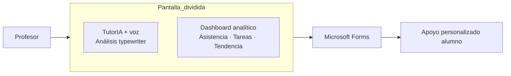
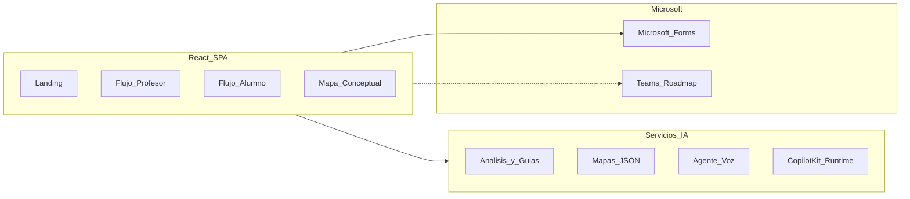

<div align="center">

# TutorIA

**Detecta el riesgo antes de que sea tarde.**

Plataforma de intervención temprana con IA para profesores y alumnos del **IPN**.

*Diseñado para vivir en ecosistema Microsoft — demo navegable con datos representativos del IPN.*

<br />

<!-- Tech stack -->


<br />

<!-- Event & context -->


<br />

[](https://github.com/FerVarg24/TutorIA)
[](https://nodejs.org/)
[](Context.md)

[Inicio rápido](#-inicio-rápido) · [Tour de demo](#-tour-de-demo) · [Arquitectura](#-arquitectura) · [Documentación](#-documentación-interna)

</div>

---

## El problema → La solución

<table>
<tr>
<td width="33%" valign="top">

### El problema

En educación superior, un profesor con **30–50 alumnos** solo descubre quién está en riesgo **al final del parcial** — cuando ya es demasiado tarde para intervenir con margen real.

</td>
<td width="33%" valign="top">

### La solución

TutorIA detecta señales de riesgo **durante el parcial** (semanas 2–3), analiza la situación con IA y activa acompañamiento personalizado: cuestionario diagnóstico, guías de estudio y recursos institucionales.

</td>
<td width="33%" valign="top">

### El diferenciador

- Intervención **temprana**, no reactiva
- Dos flujos: iniciativa del **profesor** (rojo) e iniciativa del **alumno** (morado)
- Agente conversacional con **voz** que explica el *por qué*
- Pensado para el ecosistema **Microsoft Teams**

</td>
</tr>
</table>

---

## Vista previa del flujo principal

Pantalla estrella del demo: análisis del profesor con agente TutorIA hablando y dashboard analítico construido progresivamente.



<!-- TODO: agregar captura de /profesor/alumno/2021630042 -->

---

## Características

### Flujo Profesor

| Feature | Descripción |
|---------|-------------|
| Dashboard de materias | Cards con grupo, total de alumnos y badge de alumnos en riesgo |
| Tabla semáforo | Alumnos ordenados por riesgo: rojo → amarillo → verde |
| Análisis con IA | Pantalla dividida: agente TutorIA (voz) + dashboard analítico en [`AlumnoDetalle.jsx`](src/pages/profesor/AlumnoDetalle.jsx) |
| Cuestionario diagnóstico | Envío vía **Microsoft Forms** (integración real) |
| Carga de registro | Simulación de ingesta CSV/PDF con datos representativos |

### Flujo Alumno

| Feature | Descripción |
|---------|-------------|
| Materias con semáforo | Rojo (profesor intervino) · Morado (iniciativa alumno) · Verde (sin anomalías) |
| Materia roja | Apoyo del profesor + selector de formato de guía en [`SelectorGuiaEstudio.jsx`](src/components/SelectorGuiaEstudio.jsx) |
| Resumen de audio | Explicación narrada paso a paso en [`ResumenAudio.jsx`](src/pages/alumno/ResumenAudio.jsx) |
| Mapa conceptual | Mapa interactivo React Flow + asistente tipo Copilot en [`MapaConceptual.jsx`](src/pages/alumno/MapaConceptual.jsx) |
| Presentación | Slides de repaso en [`PresentacionEstudio.jsx`](src/pages/alumno/PresentacionEstudio.jsx) |
| Materia morada | Chat multi-turno + guía generada en [`MateriaMonrada.jsx`](src/pages/alumno/MateriaMonrada.jsx) |

### Transversal

- Mascota persistente entre rutas ([`Mascota.jsx`](src/components/Mascota.jsx))
- Landing con esfera 3D y gradientes animados
- **Fallbacks de demo**: sin API keys la app sigue navegable con contenido estático

---

## Arquitectura



### Stack: demo actual → producción Microsoft

| Capa | Demo (hackathon) | Producción (roadmap) |
|------|------------------|----------------------|
| Frontend | React 19 + Vite 8 + Tailwind 4 | Teams Tab App + Azure Static Web Apps |
| Análisis / chat / guías | Anthropic API | Azure OpenAI |
| Mapas conceptuales | Gemini + React Flow + Dagre | Azure OpenAI (structured output) |
| Agente de voz | ElevenLabs | Azure Speech + Copilot Studio |
| Asistente del mapa | CopilotKit + Express 5 local | Azure Functions / App Service |
| Gráficas analíticas | Recharts | Power BI |
| Cuestionario | Microsoft Forms | Microsoft Forms + Power Automate |
| Autenticación | Sesión simulada | Azure AD institucional |

### Dependencias clave

| Paquete | Propósito |
|---------|-----------|
| `@elevenlabs/react` | Agente de voz TutorIA |
| `@copilotkit/react-core`, `@copilotkit/runtime` | Asistente contextual del mapa |
| `@xyflow/react`, `@dagrejs/dagre` | Mapa conceptual interactivo |
| `recharts` | Dashboard analítico del alumno |
| `framer-motion`, `three` | Animaciones y esfera 3D en landing |
| `react-router-dom` | Navegación SPA |

---

## Inicio rápido

### Requisitos

- **Node.js** 18 o superior
- **npm** 9+
- API keys opcionales (ver [`.env.example`](.env.example))

### Instalación

```bash
git clone https://github.com/FerVarg24/TutorIA.git
cd TutorIA
npm install
cp .env.example .env
# Edita .env con tus API keys (opcional para navegar la demo)
npm run dev
```

El comando `npm run dev` levanta en paralelo:

- **Vite** → frontend en `http://localhost:5173`
- **CopilotKit runtime** → backend en `http://localhost:3001` (proxy `/api/copilotkit`)

Otros scripts:

```bash
npm run build    # Build de producción
npm run preview  # Preview del build
npm run server   # Solo el runtime CopilotKit
```

### Variables de entorno

| Variable | Capa | Requerida para |
|----------|------|----------------|
| `VITE_ANTHROPIC_API_KEY` | Frontend | Análisis de alumno, chat morada, guías de estudio |
| `ANTHROPIC_API_KEY` | Backend | Alias del servicio Anthropic |
| `VITE_GEMINI_API_KEY` | Frontend | Generación de mapas conceptuales (JSON) |
| `VITE_GEMINI_MODEL` | Frontend | Modelo Gemini (default: `gemini-2.0-flash`) |
| `GEMINI_API_KEY` / `GOOGLE_API_KEY` | Backend | Chat lateral del mapa (CopilotKit) |
| `GEMINI_MODEL` | Backend | Modelo del runtime CopilotKit |
| `VITE_ELEVENLABS_AGENT_ID` | Frontend | Agente de voz TutorIA |
| `VITE_ELEVENLABS_API_KEY` | Frontend | API key ElevenLabs |

> **Nota:** Si falta alguna key, los servicios degradan a **texto estático de demostración**. La demo sigue siendo completamente navegable.

---

## Tour de demo

Secuencia recomendada para presentar el flujo completo:

| Paso | Ruta | Qué ver |
|:----:|------|---------|
| 1 | `/` | Landing con esfera 3D y CTAs Profesor / Alumno |
| 2 | `/login/profesor` | Login demo del profesor |
| 3 | `/profesor/materias` | Materias con badge de alumnos en riesgo |
| 4 | `/profesor/materia/calc1` | Tabla de alumnos — clic en fila roja |
| 5 | `/profesor/alumno/2021630042` | **Juan Pérez** — pantalla dividida con TutorIA + dashboard |
| 6 | Toast cuestionario | Envío simulado → Microsoft Forms |
| 7 | `/login/alumno` → `/alumno/materias` | Vista alumno con materias en colores |
| 8 | `/alumno/materia/rojo/calc1` | Apoyo del profesor + selector de guía |
| 9 | `/alumno/materia/rojo/calc1/mapa` | Mapa conceptual + asistente Copilot |
| 10 | `/alumno/materia/morado/fis1` | Chat interactivo + guía auto-generada |

### Credenciales demo

| Rol | Usuario | Contraseña |
|-----|---------|------------|
| Profesor | `profesor@ipn.mx` | `demo1234` |
| Alumno | `2021630001` (boleta) | `demo1234` |

> El login **no valida credenciales** en el prototipo — cualquier input funciona y asigna el usuario demo #0. En producción sería **Azure AD** institucional.

### Alumno estrella (demo profesor)

**Juan Pérez García** — boleta `2021630042`, Cálculo Diferencial:

| Indicador | Valor |
|-----------|-------|
| Asistencia | 60% |
| Tareas entregadas | 4/8 |
| Calificación actual | 4.8 |
| Parcial anterior | 7.2 |
| Declive | −2.4 puntos |
| Nivel de riesgo | Alto |

---

## Rutas de la aplicación

| Ruta | Descripción | Auth |
|------|-------------|:----:|
| `/` | Landing page | — |
| `/login/profesor`, `/login/alumno` | Login demo | — |
| `/profesor/materias` | Dashboard de materias | ✓ |
| `/profesor/materia/:id` | Tabla de alumnos por materia | ✓ |
| `/profesor/alumno/:boleta` | Análisis + TutorIA voz | ✓ |
| `/alumno/materias` | Materias con semáforo | ✓ |
| `/alumno/materia/rojo/:id` | Apoyo del profesor | ✓ |
| `/alumno/materia/rojo/:id/mapa` | Mapa conceptual | ✓ |
| `/alumno/materia/rojo/:id/audio` | Resumen de audio | ✓ |
| `/alumno/materia/rojo/:id/presentacion` | Presentación de diapositivas | ✓ |
| `/alumno/materia/morado/:id` | Chat + guía | ✓ |

---

## Estructura del proyecto

```
TutorIA/
├── src/
│   ├── pages/
│   │   ├── profesor/          # Dashboard, alumnos, análisis
│   │   └── alumno/            # Materias, mapa, audio, presentación
│   ├── components/
│   │   ├── mapa/              # React Flow, nodos, Copilot bridge
│   │   ├── audio/             # Reproductor y visualizador
│   │   ├── presentacion/      # Visor de slides
│   │   └── TutorIA.jsx        # Agente de voz
│   ├── services/
│   │   ├── anthropicService.js
│   │   ├── mapaGeminiService.js
│   │   └── mockData.js        # Datos demo centralizados
│   ├── hooks/                 # useMapaConceptual, usePresentacion, useResumenAudio
│   ├── context/               # AppContext (sesión + mascota)
│   └── styles/global.css      # Tokens Tailwind v4
├── server/
│   └── copilotRuntime.js      # Backend CopilotKit (Gemini)
├── Context.md                 # Visión de producto
├── DESIGN.md                  # Sistema de diseño
└── DEFENSA_QA.md              # Matriz real vs. simulado (interno)
```

---

## Estado del prototipo

Este repositorio es un **prototipo funcional navegable** del Hackathon Universitario de Impacto Social con AI — Microsoft México. La arquitectura apunta a Microsoft en producción; donde la demo usa alternativas, fue para no bloquear la experiencia de usuario.

| Funcionalidad | Real | Simulado |
|---------------|:----:|:--------:|
| Datos académicos (notas, asistencia, riesgo) | | ✓ |
| Login y sesión | | ✓ |
| Análisis IA del alumno (profesor) | ✓ | fallback |
| Agente de voz TutorIA | ✓ | fallback |
| Chat interactivo (materia morada) | ✓ | fallback |
| Generación de guías de estudio | ✓ | fallback |
| Mapa conceptual interactivo | ✓ | fallback demo |
| Asistente del mapa (tipo Copilot) | ✓ | requiere server |
| Microsoft Forms (cuestionario) | ✓ | |
| Envío de cuestionario / notificación Teams | | ✓ |
| Integración Teams (Graph API) | | ✓ |
| Carga CSV/PDF del profesor | | ✓ |

---

## Roadmap

| Fase | Objetivo | Integraciones |
|------|----------|---------------|
| **1 — Prototipo** *(actual)* | Demo navegable, flujos profesor/alumno completos | Forms, Teams (UI) |
| **2 — Piloto IPN** | Datos reales, autenticación institucional | Azure AD, Graph API, Azure OpenAI |
| **3 — Producción** | Despliegue como Teams Tab App | Copilot Studio, Power BI, Power Automate |

---

## Documentación interna

| Archivo | Contenido |
|---------|-----------|
| [`Context.md`](Context.md) | Visión de producto, módulos y reglas de desarrollo |
| [`DESIGN.md`](DESIGN.md) | Tokens de color, tipografía y componentes |
| [`DEFENSA_QA.md`](DEFENSA_QA.md) | Guía Q&A del hackathon — real vs. simulado |
| [`.env.example`](.env.example) | Template de variables de entorno |

---

<div align="center">

### Equipo TutorIA

*UHacks — UPIITA y Microsoft México*

**Reto 1:** Educación y Brecha Digital · **Institución:** IPN

<br />

[](https://github.com/FerVarg24/TutorIA)

</div>
